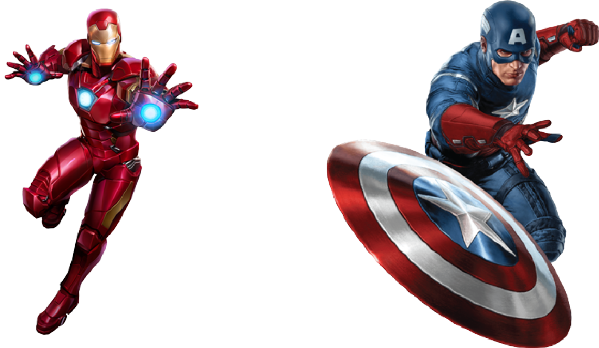

# Marvel: Ultimate War
This repository is created and optimized to serve as a code pool for the CS4 game project (A university course project written purely in Java).

## Intro
Marvel: Ultimate War is a 2 player battle game. Each player picks 3 champions to form his team
and fight the other player’s team. The players take turns to fight the other player’s champions.
The turns will keep going back and forth until a player is able to defeat all of the other player’s
champions which will make him the winner of the battle.
During the battle, each player will use his champions to attack the opponent champions either
by using normal attacks or using special attacks/abilities. The battle takes place on a 5x5 grid.
Each cell in the grid can either be empty, or contain a champion or obstacle/cover. At the
beginning of the battle, each team will stand at one of the sides/edges of the grid as a starting
position.

## Champions
Champions are the fighters that each player will form his team from. Each champion will have
a certain type which influences how the champion deals damage to other types as well as how
much damage it will receive from them. The available types are :- 
 - **Heroes**:  they deal extra damage when attacking villains.
 - **Villains**: they deal extra damage when attacking heroes.
 - **Anti-Heroes**: when being attacked or attacking a hero or villain, the antihero will always
act as the opposite type. If attacking an antihero, damage is calculated normally. 

Each champion has the following attributes and characteristics:
 - **Health points**: Represents the life of the champion. As long as the value of this attribute
   is bigger than zero, the champion will remain alive and can act in the game. Once the
   value of this attribute reaches zero, the champion is considered dead and hence, eliminated
   from the fight. 
 - **Mana:** a resource that a champion uses to use his abilities. Each time a player uses an
   ability, a certain amount of mana will be consumed. Once run out, the champion cannot
   use any of his abilities. 
 - **Normal attack damage:** The amount of damage that the champion will inflict upon
   the attacked champion while using a normal attack. This amount will be deducted from
   the attacked champion’s health points. 
 - **Normal attack range:** The maximum number of cells that the attacker’s normal attack
   can reach the attacked champion within. If the attacked champion is standing in distance
   greater than this range, the attacker can not use a normal attack on him. 
   - Range is calculated by the Manhattan distance algorithm.
 - **Speed:** Determines how fast the champion is. The faster the champion, the sooner he
     can carry out his actions before other champions. 
 - **Condition:** Represents the current ability/inability of the champion to act. The cham-
     pion can be active (can do some actions), inactive (can not do any actions until he is back
     to active), or knocked out (defeated and can not do any action till the end of the game). Possible conditions are:
   - Active: Champion can move, attack and cast abilities
   - Inactive: Champion cannot be used by player, usually due to a 'Stun' effect. But once the effect is removed the player can move, attack, and cast abilities using this champion again
   - Rooted: Has 'Rooted' effect and thus cannot move. Can still attack and cast abilities
   - Knocked out: Champion has been killed, will be moved from  the board and won't be usable anymore
 - **Actions per turn:** A number representing how many actions a player can do with the
     champion during each of his turns. Each action will consume a certain amount of this
     number. Once it reaches zero, no more actions can be done by this champion during this
     turn. This attribute resets each time the turn goes to the champion.
     Possible actions that can be done by a champion during his turn:
   - Move to an empty cell. 
   - Do a normal attack. 
   - Cast an ability. 
   - Use Leader Ability (only if champion is the player’s chosen leader)



## Abilities 
These are special attacks that a champion can use. They are categorized under the following
categories:- 
- **Damaging abilities:** Abilities that deal damage to the opponent champion(s) or covers. 
- **Healing abilities:** Abilities that restore health points to friendly champion(s). 
- **Effect abilities:** Abilities that can empower or weaken their targets by applying different
effects. These effects can last for multiple turns and will affect how the affected champion
interacts or reacts to abilities or attacks. 
  - **Example of some effects:** stun, weaken, embrace, shield, silence, disarm. 


Abilities have different targets and ranges. Some abilities are single target abilities which affect only a single 
champion (or a cover in some cases) per use. Or can affect any champion
standing in a certain area (area of effect). These areas can be directional (Horizontal or 
Vertical), or Circuilar (affect an area surrounding a central point). Finally, some abilities 
can affect all friendly or opposing champions. 

Each ability requires a certain amount of action points to be present in the champion 
casting them as well as some mana. Also, each ability has a specific range of cells that 
the target needs to be present in it in order for the ability to affect it. 

## Leader Abilities
At the beginning of the battle, each player promotes one of his champions to be the leader of
his team. The leader will then receive a special ability based on his type that can be used only
once per battle.

## Gameplay Flow
Each player will select his three champions to form his team. The champions will take turns
based on their speed. The champion with the highest speed (from all selected champions) will
begin acting first followed by the champion with the second highest speed and so on. When
the turn goes to a champion, the player controlling the champion can use him to carry out any
action as long as the champion has enough action points needed for this action and also enough
mana in case of using any of his abilities. After that, the champion can end his turn and the
turn will go to the next champion.

The turns will keep passing over the living champions till a player is able to defeat all of the
three champions of the opponent player. In this case, the game ends and the player with the
living champion will be declared the winner.

## Project Structure
<details>
<summary>Project Directory Tree:</summary>

```bash
.
├── .idea
|   └── ..........
├── src/ 
|   ├── controller
|   |   └── GameController.java
|   ├── engine
|   |   ├── Game.java
|   |   ├── Player.java
|   |   └── GameController.java
|   ├── exceptions
|   |   ├── AbilityUseException.java
|   |   ├── ChampionDisarmedException.java
|   |   ├── GameActionException.java
|   |   ├── InvalidTargetException.java
|   |   ├── LeaderAbilityAlreadyUsedException.java
|   |   ├── LeaderNotCurrentException.java
|   |   ├── NotEnoughResourcesException.java
|   |   └── UnallowedMovementException.java
|   ├── model
|   |   ├── abilities
|   |   |   ├── Ability.java
|   |   |   ├── AreaOfEffect.java
|   |   |   ├── CrowdControlAbility.java
|   |   |   ├── DamagingAbility.java
|   |   |   └── HealingAbility.java
|   |   ├── effects
|   |   |   ├── Disarm.java
|   |   |   ├── Dodge.java
|   |   |   ├── Effect.java
|   |   |   ├── EffectType.java
|   |   |   ├── Embrace.java
|   |   |   ├── PowerUp.java
|   |   |   ├── Root.java
|   |   |   ├── Shield.java
|   |   |   ├── Shock.java
|   |   |   ├── Silence.java
|   |   |   ├── SpeedUp.java
|   |   |   └── Stun.java
|   |   ├── world
|   |   |   ├── AntiHero.java
|   |   |   ├── Champion.java
|   |   |   ├── Condition.java
|   |   |   ├── Cover.java
|   |   |   ├── Damageable.java
|   |   |   ├── Direction.java
|   |   |   ├── Hero.java
|   |   |   ├── HeroClass.java
|   |   |   └── Villain.java
|   ├── tests
|   |   ├── M1PrivateTests.java
|   |   ├── M1PublicTests.java
|   |   ├── M2PrivateTests.java
|   |   └── M2PublicTests.java
|   ├── views
|   |   ├── CharacterSelectionView.java
|   |   ├── GameOverScreen.java
|   |   ├── GameView.java
|   |   └── StartScreenGUI.java
|   └── ListJavaFonts.java
└── ........

```
</details>

## Contributors 
This project was the issue of a whole semester of tireless work, sleepless nights, dedication and passion of:
- [Mohamed Shamekh](https://github.com/shamekhjr)
- [Omar Nour](https://github.com/Omar-Nour)
- [Ali Abdalwahaab](https://github.com/AliAbdalwahaab)

## Demo Run
You can check a demo run of our project [here](https://www.linkedin.com/posts/mohamed-shamekh_csen401-marvelultimatewar-teameffort-activity-6943219740198744064-_JE1?utm_source=linkedin_share&utm_medium=member_desktop_web)

